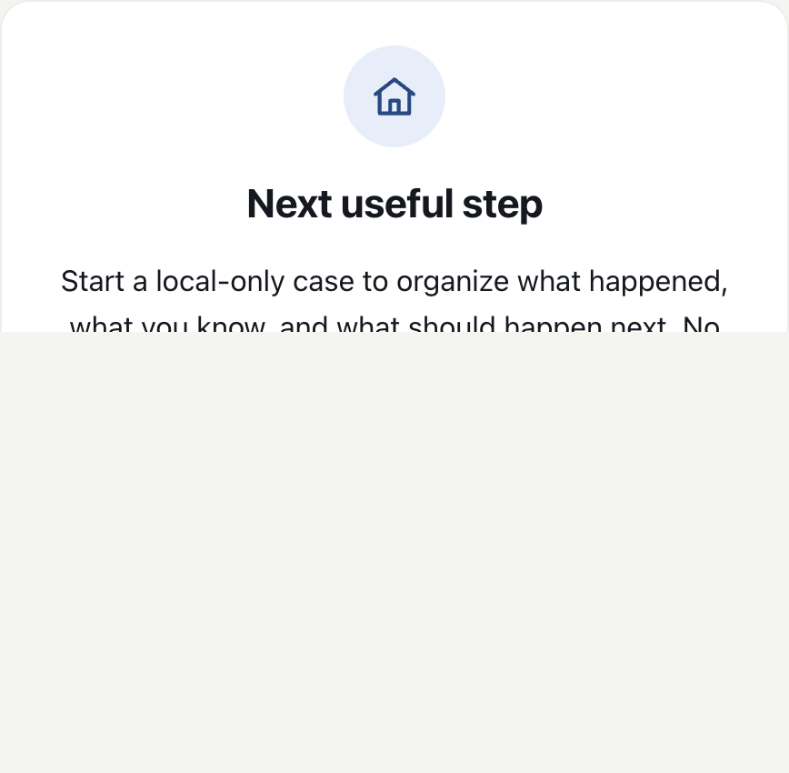
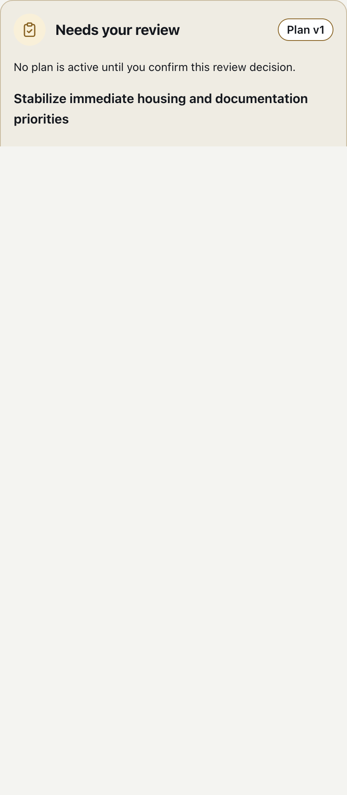
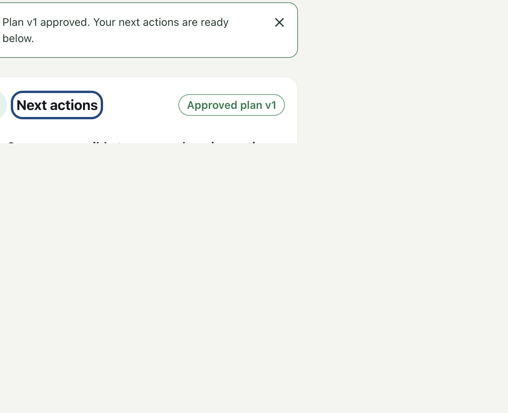
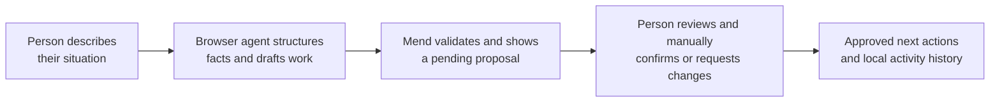

# Mend

**Mend is a calm, local-first workspace that helps a household turn a stressful disruption into a short, reviewable recovery plan—while the person keeps every consequential decision.**

> **For recovery after immediate danger.** Mend is not emergency, legal, medical, financial, insurance, or benefits advice. If you are in danger, contact local emergency services.

## See the flow

| Start safely | Review before commitment | Act on the approved plan |
| :---: | :---: | :---: |
|  |  |  |
| Load a synthetic demo with no account. | An agent can prepare; only a person can approve. | Resume with the most useful action first. |

## Why WebMCP

Household recovery scatters facts, deadlines, communications, and competing priorities across messages and memory. Conventional browser agents must infer forms from the DOM, simulate clicks, and scrape again to determine whether a change worked.

Mend exposes small, typed, state-aware [WebMCP](https://developer.chrome.com/docs/ai/webmcp) tools through `document.modelContext`. A browser agent can read the current case, add validated factual records, and stage a plan through the same tested command layer used by the visible UI. The result is local, visible, auditable, and never silently activated.



This is progressive enhancement: Mend opens in a normal browser without WebMCP, while a WebMCP-capable browser agent makes the intake and plan-staging loop structured and reliable.

## What people and agents can do

| Tool or action | Who can use it | Local effect | Guardrail |
| :--- | :--- | :--- | :--- |
| `get_recovery_snapshot` | Agent | Reads facts, plans, constraints, and allowed actions | Read-only; records are treated as untrusted data. |
| `create_recovery_case` | Agent | Creates an editable local case | Unsafe cases pause workflow. |
| `add_case_record` | Agent | Adds a plain-text factual record | Malformed data and ungrounded deadlines are rejected. |
| `stage_recovery_plan` | Agent | Stages 1–6 prioritized tasks | Always `pending_review`; cannot approve itself. |
| `stage_outreach_draft` | Agent | Creates an unsent local message draft | Copy-only; no email, SMS, upload, or send capability exists. |
| `start_plan_review` | Agent initiates | Prefills and focuses the visible review form | No autosubmit. A human must submit the form. |
| **Confirm decision** | Person | Approves a plan or requests changes | Visible click/keyboard action only; the command requires `actor: user`. |
| Task status control | Person | Updates progress on an approved task | UI-only; unavailable to WebMCP tools. |

## Try it

Open the live app: **https://mend-webmcp.netlify.app/**

1. Select **Load flood demo**.
2. In ChatGPT’s in-app browser, use this prompt:

   > I returned to an apartment flooded by a burst pipe. My partner uses a wheelchair, we can stay with a friend only until Friday, and the landlord asked for photos. We are safe now. Organize this into a recovery plan, but do not approve or send anything for me.

3. Review the proposed plan in Mend. **You**, not the agent, choose a decision and manually submit **Confirm decision**.
4. See the approved plan’s ordered **Next actions**. Drafts, if requested, remain labelled **Draft — not sent**.

### Chrome verification

ChatGPT’s in-app browser demonstrates the natural-language agent journey. For browser-level technical inspection, use real Google Chrome:

1. Enable `chrome://flags/#enable-webmcp-testing`, then relaunch Chrome.
2. Open Mend directly, then DevTools → **Application** → **WebMCP**.
3. Inspect available tools, schemas, invocation input/output, and the manual review boundary.

The [WebMCP – Model Context Tool Inspector](https://chromewebstore.google.com/detail/model-context-tool-inspec/gbpdfapgefenggkahomfgkhfehlcenpd) extension is optional for natural-language agent testing or manual calls. It is separate from Gemini in Chrome; generic Gemini browsing does not itself verify a page’s WebMCP integration. See the detailed [operator checklist](docs/evidence/t4.2/T4.2_OPERATOR_CHECKLIST.md).

## How someone uses Mend

Mend is for an adult coordinating household recovery after a flood, fire, storm, or temporary displacement—after they are safe. It helps them:

1. Identify what matters now rather than juggle unfamiliar obligations.
2. Consolidate scattered recovery facts without completing a long form.
3. Inspect, change, and approve an agent-prepared proposal before it becomes active.
4. Return later to a clear record of what was proposed, decided, and completed.

The full user/job record and journey map live in [PRODUCT.md](PRODUCT.md). The synthetic flood scenario demonstrates accessible-housing, mobility, and time-sensitive temporary-lodging constraints without using real personal data.

## Local development

### Prerequisites

- Node.js 20+
- ChatGPT’s in-app browser, or Google Chrome with WebMCP enabled, only when testing agent integration

### Setup and checks

```bash
npm ci
npm run dev
npm run lint
npm run typecheck
npm run test:run
npm run test:e2e
npm run build
```

## Architecture and evidence

Mend is a React 19 + TypeScript + Vite single-page app with MUI. Both UI controls and WebMCP handlers dispatch through `src/domain/commands.ts`; Zustand holds the validated local state and `src/state/persistence.ts` persists it only in browser `localStorage` under `mend:recovery-planner:v1`.

```text
React UI ────────┐
								 ├── shared commands ── Zustand/localStorage
WebMCP tools ────┘
```

- The [build specification](docs/BUILD_SPEC.md) is the detailed product and implementation contract.
- [Evaluation results](docs/EVAL_RESULTS.md) record real-client E-01–E-07 outcomes and deterministic proxy evidence.
- [`tests/e2e/`](tests/e2e/) covers mobile/desktop happy paths, local persistence/reset, and browser accessibility.
- [ADR 0001](docs/decisions/0001-local-first-contest-architecture.md) explains the client-only contest architecture; [ADR 0002](docs/decisions/0002-adopt-mui-for-styling.md) documents the accessible UI implementation decision.

## Privacy, safety, and known limitations

- **Local only:** no account, backend, analytics, cloud sync, or remote PII store.
- **No external action:** Mend cannot send messages, upload documents, file claims, or contact a third party.
- **Human authority:** an agent cannot approve plans or update task status; `toolautosubmit` is intentionally absent.
- **Grounded plans:** deadlines must be tied to explicit case records; unsafe cases cannot stage plans or drafts.
- **Contest-build limitation:** without WebMCP, Mend supports loading the demo, viewing/reviewing staged work, updating task status, copying drafts, and deletion. It does **not** include full manual fact-entry or plan-authoring interfaces.
- **Synthetic only:** the flood demo contains no real names, addresses, claim numbers, contacts, or medical details.

## Challenge scope

Mend was built for the WebMCP Challenge during the challenge period. The included work is the local-first recovery workflow, typed imperative tools, declarative human review gate, deterministic tests, accessibility hardening, and production/evaluation evidence. It deliberately excludes a backend, authentication, outbound messaging, uploads, live disaster data, and autonomous decision-making.

## License

Mend is released under the [MIT License](LICENSE).
